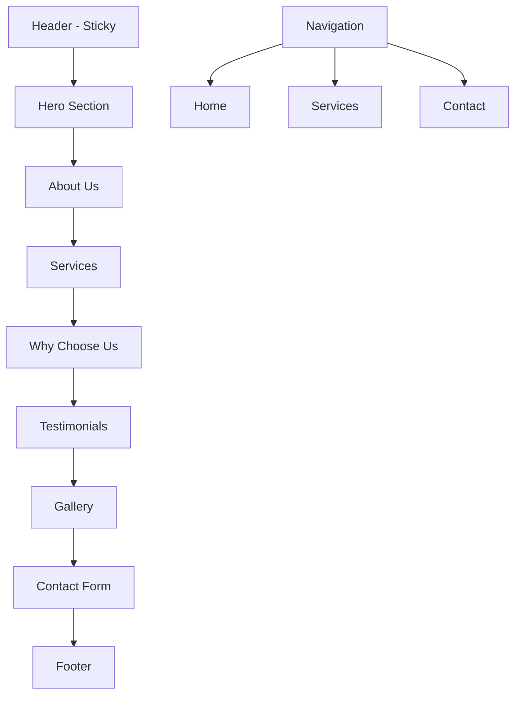
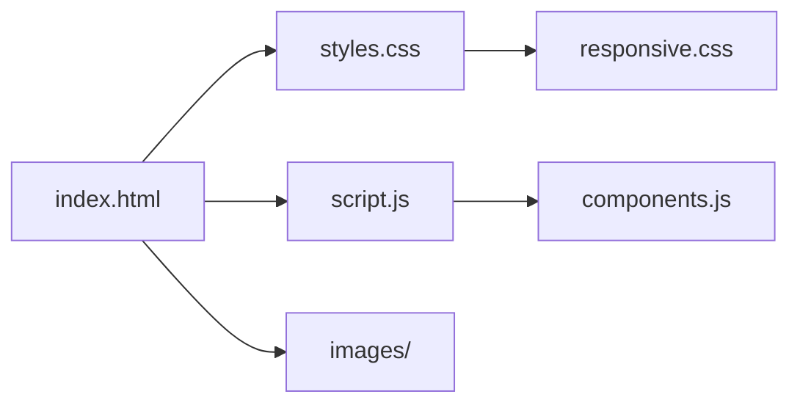

# Super Spark Electrical Website Plan

## Overview

We'll create a modern, vibrant single-page scrolling website for Super Spark Electrical, a residential electrical service business based in Western Sydney, Australia. The website will focus on attracting homeowners, particularly families in the Parramatta area, with a color scheme of orange, grey, and black.

## Website Structure



## Technical Architecture



## File Structure

```
super-spark-electrical/
├── index.html          # Main HTML file with all sections
├── css/
│   ├── styles.css      # Main stylesheet
│   └── responsive.css  # Responsive design rules
├── js/
│   ├── script.js       # Main JavaScript file
│   └── components.js   # Reusable components
├── images/             # Directory for all images
└── README.md           # Project documentation
```

## Detailed Section Breakdown

### 1. Header (Sticky)
- Logo: Text-based "Super Spark Electrical" with a lightning bolt emoji (⚡)
- Navigation: Home, Services, Contact (smooth scroll to sections)
- Call-to-action button: "Get a Free Quote"
- Mobile-responsive hamburger menu

### 2. Hero Section
- Headline: "Trusted Electrical Services in Western Sydney"
- Subheadline: "Professional, Reliable, and Affordable Electrical Solutions for Your Home"
- Background: High-quality image of Sydney cityscape or a modern home with good lighting
- CTA button: "Explore Our Services" or "Contact Us Today"

### 3. About Us
- Brief company introduction
- Value proposition
- Service area highlight (Parramatta and Western Sydney)
- Licensing and certification information
- Trust indicators (years of experience, number of satisfied customers)

### 4. Services Section
- Highlight specialized services with icons and brief descriptions:
  1. **Switchboard Upgrades and Repairs**
  2. **Ceiling Fan Installation**
  3. **Home Rewiring**
  4. Additional services: Power points, lighting installation, safety switches, etc.
- Each service will have a "Learn More" option that expands to show additional details

### 5. Why Choose Us
- Points of difference (reliability, punctuality, cleanliness, etc.)
- Benefits for homeowners (safety, energy efficiency, modern solutions)
- Guarantees and warranties
- Emergency service availability

### 6. Testimonials
- Carousel of customer reviews
- Star ratings
- Customer names and suburbs (Parramatta, etc.)
- Brief quotes about their experience

### 7. Gallery
- Before/after images of completed projects
- Organized by service type
- Lightbox functionality for enlarged viewing

### 8. Contact Section
- Service request form
- Contact details (placeholder)
- Service hours
- Service area map highlighting Western Sydney
- Emergency contact information

### 9. Footer
- Simple design with:
  - Copyright information
  - Privacy policy link
  - Terms of service link
  - Social media icons (if applicable)
  - Back to top button

## Design Elements

### Color Scheme
- Primary: Orange (#FF7F00) - For CTAs, highlights, and accents
- Secondary: Dark Grey (#333333) - For text and secondary elements
- Tertiary: Light Grey (#F5F5F5) - For backgrounds and contrast
- Black (#000000) - For certain text elements and contrast

### Typography
- Headings: Modern sans-serif font (e.g., Montserrat)
- Body: Clean, readable sans-serif (e.g., Open Sans)
- Appropriate sizing and contrast for accessibility

### Visual Elements
- High-quality stock photos from Unsplash featuring:
  - Modern homes
  - Electrical work
  - Family settings
  - Sydney/Parramatta cityscapes
- Icons for services and features
- Subtle animations for engagement

## SEO Strategy

### Keywords to Target
- Primary: "Electrician Parramatta"
- Secondary:
  - "Residential electrician Western Sydney"
  - "Switchboard upgrades Sydney"
  - "Ceiling fan installation Parramatta"
  - "Home rewiring Western Sydney"
  - "Electrical services for families"

### On-Page SEO
- Optimized meta tags
- Semantic HTML structure
- Proper heading hierarchy
- Alt text for all images
- Schema markup for local business
- Mobile-friendly design (Google ranking factor)
- Fast loading times

## Technical Implementation

### HTML
- Semantic HTML5 elements
- Accessibility considerations (ARIA attributes, proper contrast)
- Structured data markup

### CSS
- Modular CSS with BEM methodology
- Responsive design using flexbox and CSS grid
- CSS variables for consistent theming
- Optimized for performance

### JavaScript
- Vanilla JavaScript for core functionality
- Minimal dependencies for performance
- Smooth scrolling navigation
- Form validation
- Interactive elements (service expansions, testimonial carousel)
- Lazy loading for images

## Responsive Design Strategy
- Mobile-first approach
- Breakpoints for:
  - Mobile (< 768px)
  - Tablet (768px - 1024px)
  - Desktop (> 1024px)
- Flexible layouts that adapt to different screen sizes
- Touch-friendly elements for mobile users

## Performance Optimization
- Compressed and properly sized images
- Minified CSS and JavaScript
- Lazy loading for below-the-fold content
- Limited use of external libraries

## Conversion Optimization
- Strategic placement of CTAs
- Social proof elements (testimonials, trust badges)
- Clear value proposition
- Simplified contact form
- Prominent display of service area (Parramatta/Western Sydney)
- Emergency service highlights

## Implementation Plan

1. **Setup Project Structure**
   - Create directory structure
   - Initialize base files

2. **Develop Core HTML Structure**
   - Create semantic markup for all sections
   - Implement navigation structure

3. **Style Development**
   - Implement base styles and typography
   - Develop component-specific styles
   - Create responsive design rules

4. **JavaScript Functionality**
   - Implement smooth scrolling
   - Develop interactive components
   - Create form validation

5. **Content Population**
   - Add service descriptions
   - Source and optimize images
   - Create testimonials

6. **SEO Implementation**
   - Optimize meta tags
   - Add structured data
   - Implement alt text for images

7. **Testing**
   - Cross-browser testing
   - Responsive design testing
   - Performance optimization

8. **Finalization**
   - Code cleanup and documentation
   - Final performance checks